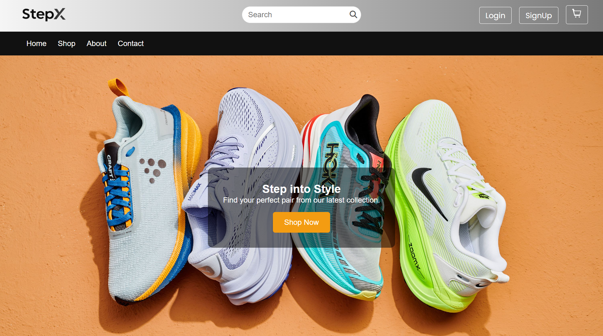
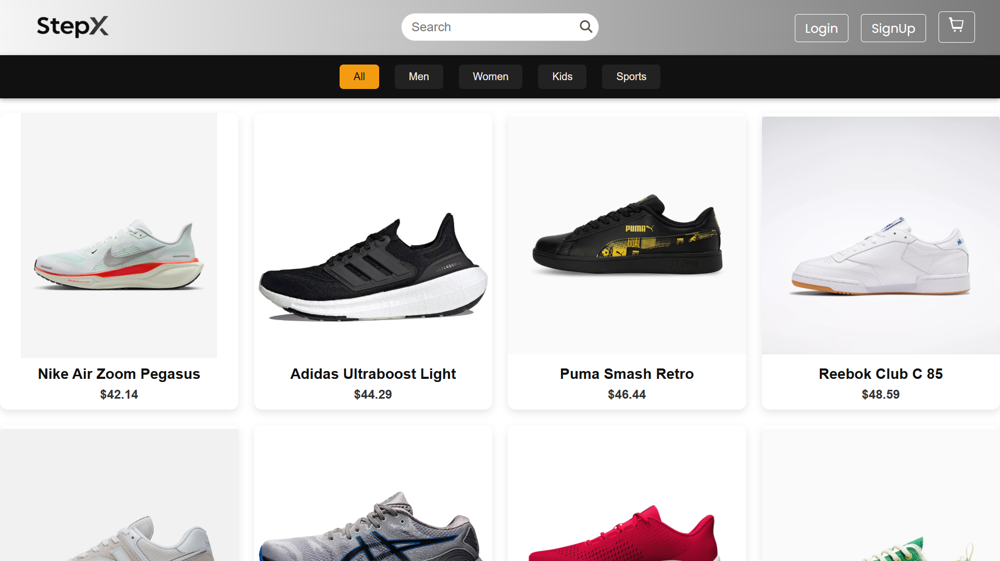
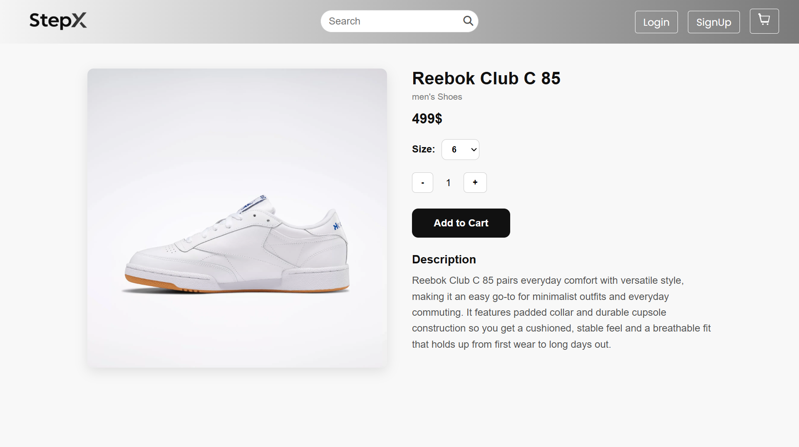

# 🥿 StepX Shoe E-commerce (Angular)

A simple **Angular-based shoe e-commerce frontend** with product listing, product details, user login/signup, and cart functionality.  
Currently frontend-only, with plans to add a **.NET backend** and more advanced features.

---

## ✨ Features Implemented

- 🔍 Product search  
- 🛍️ Product listing with details view  
- 🛒 Shopping cart functionality  
- 👤 User login/signup (frontend only)  
- 🛠️ Admin module (in progress)  
- 💳 Dummy payment section  
- 🎨 Focused purely on **frontend** with Angular  
- ⚡ Toast messages for notifications (basic for now)  

---

## 🛠️ Tech Stack

- **Frontend:** Angular, TypeScript, HTML, CSS  
- **Version Control:** Git & GitHub  

---

## Screenshots

### Home Page


### Product Page


### Product Detail Page



---

## 📂 Project Structure

```
└── 📁src
    └── 📁app
        └── 📁core
            └── 📁guards
                ├── auth.guard.spec.ts
                ├── auth.guard.ts
                ├── unsaved-changes.guard.ts
            └── 📁models
                ├── cartItems.model.ts
                ├── product.model.ts
                ├── user.model.ts
            └── 📁services
                ├── auth.service.spec.ts
                ├── auth.service.ts
                ├── cart.service.spec.ts
                ├── cart.service.ts
                ├── product.service.spec.ts
                ├── product.service.ts
                ├── search.service.spec.ts
                ├── search.service.ts
            └── 📁validators
                ├── passwordMatchValidator.ts
            ├── core.module.ts
        └── 📁features
            └── 📁auth
                └── 📁login-page
                    ├── login-page.component.html
                    ├── login-page.component.scss
                    ├── login-page.component.spec.ts
                    ├── login-page.component.ts
                └── 📁sign-up-page
                    ├── sign-up-page.component.html
                    ├── sign-up-page.component.scss
                    ├── sign-up-page.component.spec.ts
                    ├── sign-up-page.component.ts
                ├── auth-routing.module.ts
                ├── auth.module.ts
            └── 📁cart
                └── 📁cart-page
                    ├── cart-page.component.html
                    ├── cart-page.component.scss
                    ├── cart-page.component.spec.ts
                    ├── cart-page.component.ts
                ├── cart-routing.module.ts
                ├── cart.module.ts
            └── 📁checkout
                └── 📁checkout-page
                    ├── checkout-page.component.html
                    ├── checkout-page.component.scss
                    ├── checkout-page.component.spec.ts
                    ├── checkout-page.component.ts
                └── 📁order-placed
                    ├── order-placed.component.html
                    ├── order-placed.component.scss
                    ├── order-placed.component.spec.ts
                    ├── order-placed.component.ts
                ├── checkout-routing.module.ts
                ├── checkout.module.ts
            └── 📁home
                └── 📁home page
                    ├── home.component.html
                    ├── home.component.scss
                    ├── home.component.spec.ts
                    ├── home.component.ts
                ├── home-routing.module.ts
                ├── home.module.ts
            └── 📁not-found-page
                ├── not-found-page.component.html
                ├── not-found-page.component.scss
                ├── not-found-page.component.spec.ts
                ├── not-found-page.component.ts
            └── 📁products
                └── 📁product-detail-page
                    ├── product-detail-page.component.html
                    ├── product-detail-page.component.scss
                    ├── product-detail-page.component.spec.ts
                    ├── product-detail-page.component.ts
                └── 📁product-page
                    ├── product-page.component.html
                    ├── product-page.component.scss
                    ├── product-page.component.spec.ts
                    ├── product-page.component.ts
                ├── products-routing.module.ts
                ├── products.module.ts
            └── 📁userProfile
                └── 📁profile-page
                    ├── profile-page.component.html
                    ├── profile-page.component.scss
                    ├── profile-page.component.spec.ts
                    ├── profile-page.component.ts
                ├── userprofile-routing.module.ts
                ├── userprofile.module.ts
        └── 📁shared
            └── 📁footer
                ├── footer.component.html
                ├── footer.component.scss
                ├── footer.component.spec.ts
                ├── footer.component.ts
            └── 📁navbar
                ├── navbar.component.html
                ├── navbar.component.scss
                ├── navbar.component.spec.ts
                ├── navbar.component.ts
            ├── shared-routing.module.ts
            ├── shared.module.ts
        ├── app-routing.module.ts
        ├── app.component.html
        ├── app.component.scss
        ├── app.component.spec.ts
        ├── app.component.ts
        ├── app.module.ts
    └── 📁assets
        ├── .gitkeep
        ├── banner.jpg
        ├── Step-X-logo-black.png
        ├── Step-X-logo-white.png
        ├── StepX.png
        ├── StepXLogo.png
        ├── unavailable1.png
    ├── favicon.ico
    ├── index.html
    ├── main.ts
    └── styles.scss
```


---

## 🚀 Getting Started

### 1. Clone the repository

git clone https://github.com/Faiz-mohamed/stepx-shoe-ecommerce.git
cd stepx-shoe-ecommerce
### 2. Install dependencies

npm install
### 3. Run the app locally

ng serve
The app will be available at: http://localhost:4200/


### 📌 Roadmap

✅ Product search & listing

✅ Product details page

✅ Cart functionality

✅ User login/signup

❌ Admin functionalities

❌ Improved toast notifications

❌ Responsive CSS for all screens

❌ Bug fixes in cart

❌ .NET backend integration

❌ Payment gateway integration

❌ Code scalability & maintainability improvements


👨‍💻 Author

Faiz Mohamed

🌐 Portfolio: [faizPortfolio](https://faiz-mohamed.github.io/faizPortfolio/)

💻 GitHub: [Faiz-mohamed](https://github.com/Faiz-mohamed)

🔗 LinkedIn: [Faiz Mohamed](https://www.linkedin.com/in/faiz-mohamed556/)


# Shoe

This project was generated with [Angular CLI](https://github.com/angular/angular-cli) version 16.2.16.

## Development server

Run `ng serve` for a dev server. Navigate to `http://localhost:4200/`. The application will automatically reload if you change any of the source files.
